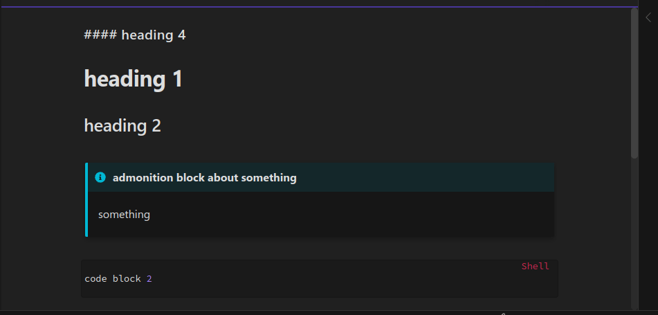
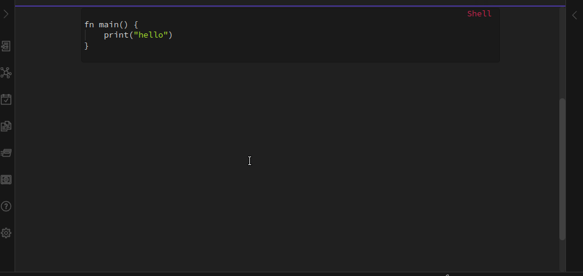

# Obsidian Keyboard Shortcuts

these are just to cover my own most-used use cases

## Go to previous/next heading

- note: only works in edit mode

## Copy code block / Copy next code block 

- Copy code block: shows a list of code blocks and allows you to search and copy one of them
- Copy next code block: copies the next code block, closest to the cursor

## Insert heading 4 / Insert code block / Insert info admonition

- also moves the cursor inside the code block / to the title after using
- the default language of the code block is configurable in settings

