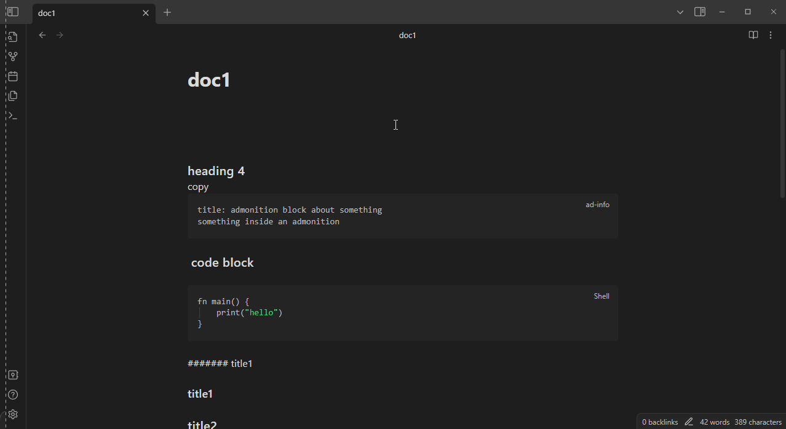

# Quick snippets and navigation for Obsidian

- Keyboard navigation up/down for headings
- Configurable default code block and callout shortcuts
- Copy code block via keyboard shortcut
- Quick Switcher extensions

no keybinds are set on install, you have to configure them yourself

## List of commands: 

- Go to previous heading
- Go to next heading
- Select current heading block
- Go to previous empty line
- Go to next empty line
- Copy Next Code Block
- Copy Code Block
- Search by Tag
- Increase Heading level
- Decrease Heading level
- Insert Default Callout
- Insert Code Block

### Go to previous/next heading and Go to previous/next empty line

- note: only works in edit mode


### Select current heading block

- Select current heading block: selects text until the next heading or end of document


### Copy code block / Copy next code block 

- Copy code block: shows a list of code blocks and allows you to search and copy one of them
- Copy next code block: copies the next code block, closest to the cursor


### Switcher extensions

> NOTE: these require you to configure `Default modal command` in the plugin settings:

> For the following demos i used the [Another Quick Switcher plugin](https://github.com/tadashi-aikawa/obsidian-another-quick-switcher) which supports tags and set `Default modal command` to:

```
obsidian-another-quick-switcher:search-command_recent-search
```

#### Switcher extensions / Search by tag

Allows performing a 2-step search, first filtering notes by tag.


#### Switcher extensions / Folded search by Tag

Tag search with:
- Unfolding tags
- AND queries


<!--  -->


### Insert code block / Insert callout

- also moves the cursor inside the code block / to the title after using
- the default language of the code block is configurable in settings
- the default callout type is also configurable in settings


## development

### dependencies

- dotnet sdk
- npm

### ---

installing node and dotnet dependencies
```
npm i
npm run install
```

compiling F# to js
```
npm run build
```

publishing to dist/
```
npm run publish
```